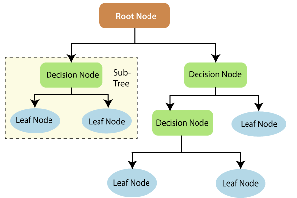
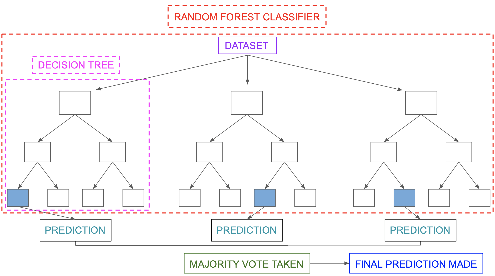
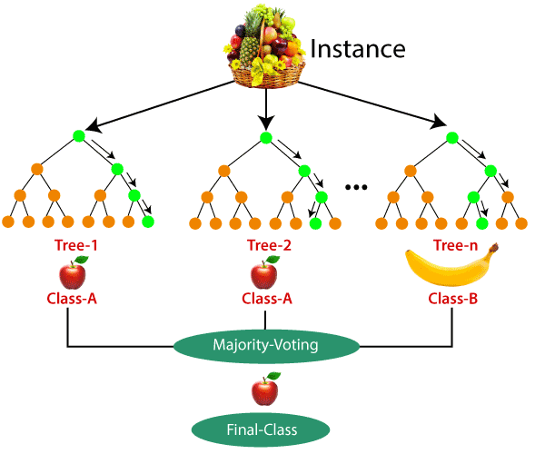

# Random Forest
A random forest is a supervised machine learning algorithm that is constructed from decision tree algorithms. A random forest is a collection of decision trees that are trained with a random sample of data points, a random selection of features, and bootstrapping. The random forest algorithm combines the output of individual decision trees to generate the final output.

### What is a Random Forest?
A random forest is a machine learning technique that’s used to solve regression and classification problems. It utilizes ensemble learning, which is a technique that combines many classifiers to provide solutions to complex problems.

A random forest algorithm consists of many decision trees. The ‘forest’ generated by the random forest algorithm is trained through bagging or bootstrap aggregating. Bagging is an ensemble meta-algorithm that improves the accuracy of machine learning algorithms.

The (random forest) algorithm establishes the outcome based on the predictions of the decision trees. It predicts by taking the average or mean of the output from various trees. Increasing the number of trees increases the precision of the outcome.

A random forest eradicates the limitations of a decision tree algorithm. It reduces the overfitting of datasets and increases precision. It generates predictions without requiring many configurations in packages (like scikit-learn).

### Features of a Random Forest Algorithm
- It’s more accurate than the decision tree algorithm.
- It provides an effective way of handling missing data.
- It can produce a reasonable prediction without hyper-parameter tuning.
- It solves the issue of overfitting in decision trees.
- In every random forest tree, a subset of features is selected randomly at the node’s splitting point.

### How random forest algorithm works

#### Decision Tree
Decision trees are the building blocks of a random forest algorithm. A decision tree is a decision support technique that forms a tree-like structure. An overview of decision trees will help us understand how random forest algorithms work.

A decision tree consists of three components: decision nodes, leaf nodes, and a root node. A decision tree algorithm divides a training dataset into branches, which further segregate into other branches. This sequence continues until a leaf node is attained. The leaf node cannot be segregated further.

The nodes in the decision tree represent attributes that are used for predicting the outcome. Decision nodes provide a link to the leaves. The following diagram shows the three types of nodes in a decision tree.

Entropy is a metric for calculating uncertainty. Information gain is a measure of how uncertainty in the target variable is reduced, given a set of independent variables.

The information gain concept involves using independent variables (features) to gain information about a target variable (class). The entropy of the target variable (Y) and the conditional entropy of Y (given X) are used to estimate the information gain. In this case, the conditional entropy is subtracted from the entropy of Y.

Information gain is used in the training of decision trees. It helps in reducing uncertainty in these trees. A high information gain means that a high degree of uncertainty (information entropy) has been removed. Entropy and information gain are important in splitting branches, which is an important activity in the construction of decision trees.

### Applying decision trees in random forest
The main difference between the decision tree algorithm and the random forest algorithm is that establishing root nodes and segregating nodes is done randomly in the latter. The random forest employs the bagging method to generate the required prediction.

Bagging involves using different samples of data (training data) rather than just one sample. A training dataset comprises observations and features that are used for making predictions. The decision trees produce different outputs, depending on the training data fed to the random forest algorithm. These outputs will be ranked, and the highest will be selected as the final output.

### Classification in random forests
Classification in random forests employs an ensemble methodology to attain the outcome. The training data is fed to train various decision trees. This dataset consists of observations and features that will be selected randomly during the splitting of nodes.

A rain forest system relies on various decision trees. Every decision tree consists of decision nodes, leaf nodes, and a root node. The leaf node of each tree is the final output produced by that specific decision tree. The selection of the final output follows the majority-voting system. In this case, the output chosen by the majority of the decision trees becomes the final output of the rain forest system. The diagram below shows a simple random forest classifier.

Let’s take an example of a training dataset consisting of various fruits such as bananas, apples, pineapples, and mangoes. The random forest classifier divides this dataset into subsets. These subsets are given to every decision tree in the random forest system. Each decision tree produces its specific output. For example, the prediction for trees 1 and 2 is apple.

Another decision tree (n) has predicted banana as the outcome. The random forest classifier collects the majority voting to provide the final prediction. The majority of the decision trees have chosen apple as their prediction. This makes the classifier choose apple as the final prediction.

### Regression in random forests
Regression is the other task performed by a random forest algorithm. A random forest regression follows the concept of simple regression. Values of dependent (features) and independent variables are passed in the random forest model.

We can run random forest regressions in various programs such as SAS, R, and python. In a random forest regression, each tree produces a specific prediction. The mean prediction of the individual trees is the output of the regression. This is contrary to random forest classification, whose output is determined by the mode of the decision trees’ class.

Although random forest regression and linear regression follow the same concept, they differ in terms of functions. The function of linear regression is y=bx + c, where y is the dependent variable, x is the independent variable, b is the estimation parameter, and c is a constant. The function of a complex random forest regression is like a blackbox. It’s difficult to understand the relationship between the dependent and independent variables.

### Applications of random forest
Some of the applications of the random forest may include:

#### Banking
Random forest is used in banking to predict the creditworthiness of a loan applicant. This helps the lending institution make a good decision on whether to give the customer the loan or not. Banks also use the random forest algorithm to detect fraudsters.

#### Health care
Health professionals use random forest systems to diagnose patients. Patients are diagnosed by assessing their previous medical history. Past medical records are reviewed to establish the right dosage for the patients.

#### Stock market
Financial analysts use it to identify potential markets for stocks. It also enables them to identify the behavior of stocks.

#### E-commerce
Through rain forest algorithms, e-commerce vendors can predict the preference of customers based on past consumption behavior.

### When to avoid using random forests
Random forest algorithms are not ideal in the following situations:

#### Extrapolation
Random forest regression is not ideal in the extrapolation of data. Unlike linear regression, which uses existing observations to estimate values beyond the observation range. This explains why most applications of random forest relate to classification.

#### Sparse data
Random forest does not produce good results when the data is very sparse. In this case, the subset of features and the bootstrapped sample will produce an invariant space. This will lead to unproductive splits, which will affect the outcome.

### Advantages of random forest
- It can perform both regression and classification tasks.
- A random forest produces good predictions that can be understood easily.
- It can handle large datasets efficiently.
- The random forest algorithm provides a higher level of accuracy in predicting outcomes over the decision tree algorithm.

### Disadvantages of random forest
- When using a random forest, more resources are required for computation.
- It consumes more time compared to a decision tree algorithm.