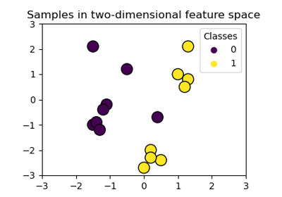

# Support Vector Machine (SVM)

Support Vector Machine (SVM) is a relatively simple **Supervised Machine Learning Algorithm** used for classification and/or regression. It is more preferred for classification but is sometimes very useful for regression as well. Basically, SVM finds a hyper-plane that creates a boundary between the types of data. In 2-dimensional space, this hyper-plane is nothing but a line. In SVM, we plot each data item in the dataset in an N-dimensional space, where N is the number of features/attributes in the data. Next, find the optimal hyperplane to separate the data. So by this, you must have understood that inherently, SVM can only perform binary classification (i.e., choose between two classes). Classification for multiple classes is supported by a one-vs-all method (just like one-vs-rest logistic regression).

## Hyperplane
A hyperplane is a decision boundary which separates between given set of data points having different class labels. The SVM classifier separates data points using a hyperplane with the maximum amount of margin. This hyperplane is known as the maximum margin hyperplane and the linear classifier it defines is known as the maximum margin classifier.

## Support Vectors
Support vectors are the sample data points, which are closest to the hyperplane. These data points will define the separating line or hyperplane better by calculating margins.

## Margin
A margin is a separation gap between the two lines on the closest data points. It is calculated as the perpendicular distance from the line to support vectors or closest data points. In SVMs, we try to maximize this separation gap so that we get maximum margin.

The following diagram illustrates these concepts visually.

<figcaption>Margin in SVM</figcaption>

## SVM Under the hood
In SVMs, our main objective is to select a hyperplane with the maximum possible margin between support vectors in the given dataset. SVM searches for the maximum margin hyperplane in the following 2 step process –

Generate hyperplanes which segregates the classes in the best possible way. There are many hyperplanes that might classify the data. We should look for the best hyperplane that represents the largest separation, or margin, between the two classes.

So, we choose the hyperplane so that distance from it to the support vectors on each side is maximized. If such a hyperplane exists, it is known as the maximum margin hyperplane and the linear classifier it defines is known as a maximum margin classifier.

The following diagram illustrates the concept of maximum margin and maximum margin hyperplane in a clear manner.

<figcaption>Maximum margin hyperplane</figcaption>

## Problem with dispersed datasets
Sometimes, the sample data points are so dispersed that it is not possible to separate them using a linear hyperplane. In such a situation, SVMs uses a kernel trick to transform the input space to a higher dimensional space as shown in the diagram below. It uses a mapping function to transform the 2-D input space into the 3-D input space. Now, we can easily segregate the data points using linear separation.

Kernel trick - transformation of input space to higher dimensional space
Kernel trick

## Kernel trick 
In practice, SVM algorithm is implemented using a kernel. It uses a technique called the kernel trick. In simple words, a kernel is just a function that maps the data to a higher dimension where data is separable. A kernel transforms a low-dimensional input data space into a higher dimensional space. So, it converts non-linear separable problems to linear separable problems by adding more dimensions to it. Thus, the kernel trick helps us to build a more accurate classifier. Hence, it is useful in non-linear separation problems.

We can define a kernel function as follows-

<figcaption>Kernel function</figcaption>

In the context of SVMs, there are 4 popular kernels – **Linear kernel,Polynomial kernel,Radial Basis Function (RBF) kernel (also called Gaussian kernel) and Sigmoid kernel**. These are described below -

### Linear kernel
In linear kernel, the kernel function takes the form of a linear function as follows-

Linear kernel: $$K(x_i, x_j) = x_i^T x_j$$

Linear kernel is used when the data is linearly separable. It means that data can be separated using a single line. It is one of the most common kernels to be used. It is mostly used when there are large number of features in a dataset. Linear kernel is often used for text classification purposes.

Training with a linear kernel is usually faster, because we only need to optimize the C regularization parameter. When training with other kernels, we also need to optimize the γ parameter. So, performing a grid search will usually take more time.

Linear kernel can be visualized with the following figure.

<figcaption>Linear Kernel</figcaption>

### Polynomial Kernel
Polynomial kernel represents the similarity of vectors (training samples) in a feature space over polynomials of the original variables. The polynomial kernel looks not only at the given features of input samples to determine their similarity, but also combinations of the input samples.

For degree-d polynomials, the polynomial kernel is defined as follows –

Polynomial kernel : $$K(x_i , x_j) = (γx_i^T x_j + r)d , γ > 0$$

Polynomial kernel is very popular in Natural Language Processing. The most common degree is d = 2 (quadratic), since larger degrees tend to overfit on NLP problems. It can be visualized with the following diagram.

<figcaption>Polynomial Kernel</figcaption>

### Radial Basis Function Kernel
Radial basis function kernel is a general purpose kernel. It is used when we have no prior knowledge about the data. The RBF kernel on two samples x and y is defined by the following equation –

Radial Basis Function kernel
RBK Kernel

The following diagram demonstrates the SVM classification with rbf kernel.

<figcaption>RBF Kernel</figcaption>

### Sigmoid kernel
Sigmoid kernel has its origin in neural networks. We can use it as the proxy for neural networks. Sigmoid kernel is given by the following equation –

sigmoid kernel : $$k (x, y) = tanh(αx^Ty + c)$$

Sigmoid kernel can be visualized with the following diagram-

<figcaption>Sigmoid kernel</figcaption>

